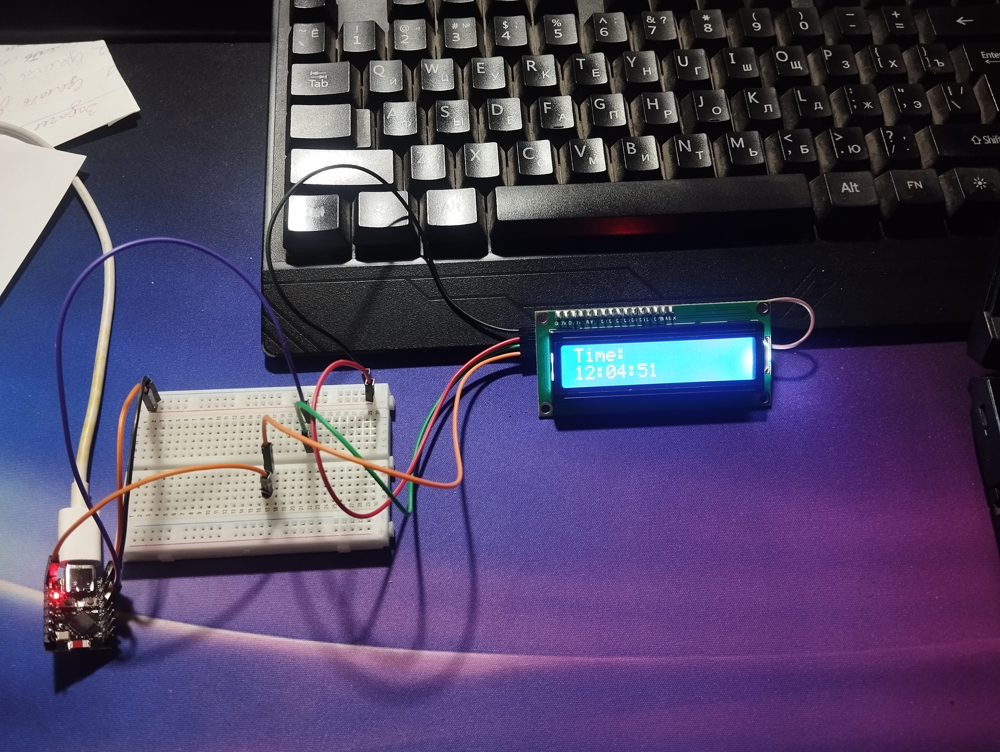
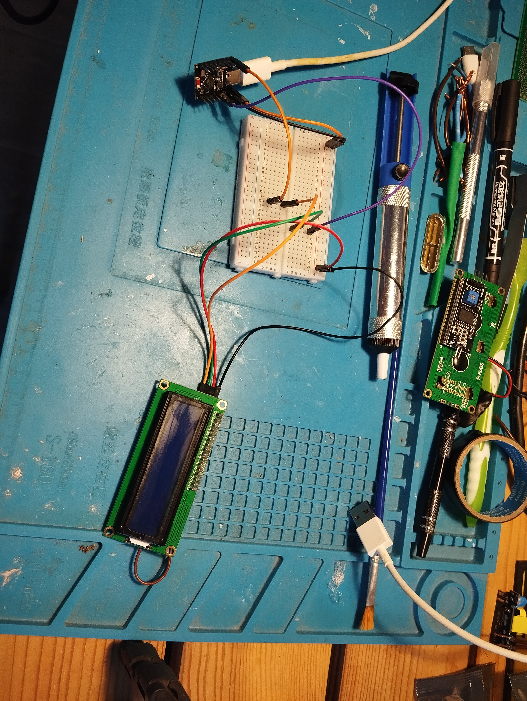
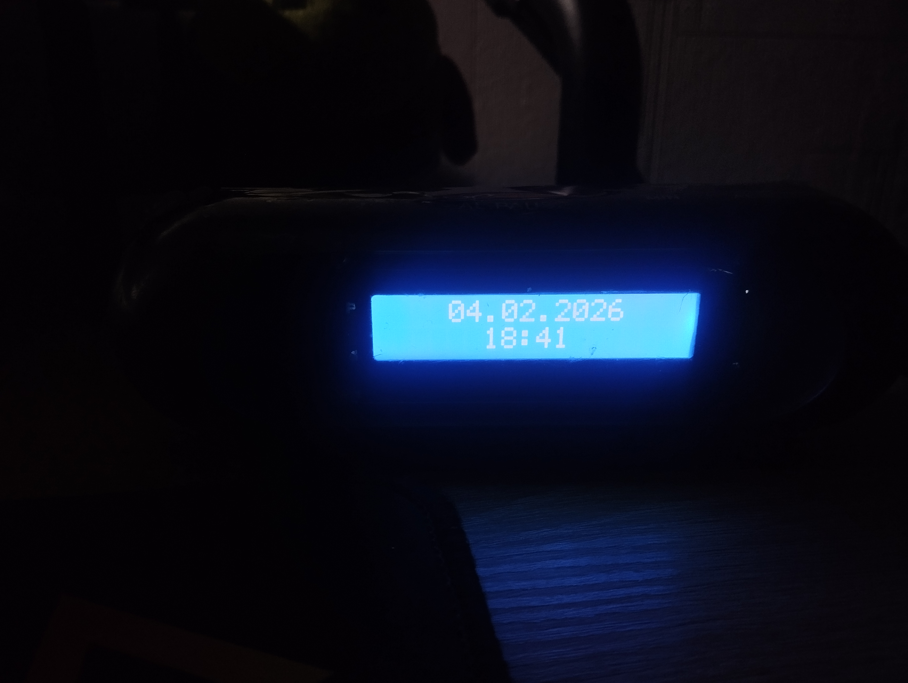

# 🕒 Smart Clock (UDFSmart)
**Smart Clock** is a firmware for a smart digital clock based on the ESP32-C3 microcontroller and an LCD 1602 (I2C) display. The device synchronizes time and date automatically and receives commands from the UDFSmart central control server via a secure connection (HTTPS).

The project is designed with a focus on autonomy, remote control, and easy integration into a smart home ecosystem.
---

## ✨ Key Features
* 📅 Time & Date Display: Automatic time synchronization with the server.
* 📩 Messaging System: Ability to display custom text on the screen via API (using the SHOW_MESSAGE command).
* 🌐 Easy Wi-Fi Setup: Uses a Captive Portal (WiFiManager) to connect to a network without reflashing the device.
* 🔄 Remote Control: Supports remote reboot and factory reset commands over the internet.
* 🔒 Security: Device authentication using API_KEY and DEVICE_ID.
* 📊 Telemetry: Sends device status (RSSI, Uptime, Free Heap) with every server poll.
  ---

## 🛠 Hardware & Wiring
The project is configured for the following hardware (based on the source code):

  * Microcontroller: ESP32-C3 (or compatible ESP32 board).
  * Display: LCD 1602 with I2C module (Address 0x27).

Wiring Diagram (I2C):

| LCD 1602  |	ESP32-C3 (GPIO) |
| --------- | --------------- |
| SDA	      | GPIO 4          |
| SCL	      | GPIO 5          |
| VCC	      | 5V / 3.3V       |
| GND	      | GND             |

_Note: I2C pins are initialized in main.cpp as: Wire.begin(4, 5);._
---

## ⚙️ Installation & Configuration
1. **Dependencies**
To compile the project, you need PlatformIO or Arduino IDE with the following libraries installed:

  * LiquidCrystal_I2C
  * WiFiManager
  * ArduinoJson (optional, dependent on future extensions)
  * Standard ESP32 libraries (WiFi, HTTPClient, WiFiClientSecure).

2. **Configuration (config.h)**

Before flashing, you must edit the config.h file to include your unique credentials.

```cpp
// config.h

// Your unique device ID
#define DEVICE_ID "YOUR-DEVICE-UUID-HERE" 

// Your secret API Key
#define API_KEY "YOUR-API-KEY-HERE"

// Device controller type (change if using a different chip)
#define DEVICE_CONTROLLER_TYPE "esp32-c3"
```

ℹ️ How to get keys? To obtain your DEVICE_ID and API_KEY, please contact support: support@udfsoft.com.
---

## 🚀 First Run
  1. Upload the firmware to your device.
  2. On the first boot (or if Wi-Fi is not configured), the display will show "WiFi Connecting", followed by "Failed to connect".
  3. The device will create a Wi-Fi Access Point (AP):
       * **SSID:** SMART_CLOCK_AP
       * **Password:** 12345678

  4. Connect to this network using your phone or laptop.
  5. A Captive Portal should open automatically. Select your home Wi-Fi network and enter the password.
  6. The device will save settings, reboot, and connect to the server.
---

## 📡 API & Commands

The device operates in Long Polling mode. By default, it polls the server every 15 seconds (this interval can be adjusted by the server via the X-POLL-INTERVAL header).

**Supported Server Commands**
The device processes commands received in the X-CMD HTTP header:

| Command          |	Parameter (X-CMD-PARAM)     |	Description                                         |
| ---------------- | ---------------------------- | --------------------------------------------------- |
| UPDATE_TIME	     | TIMESTAMP (Unix)             | Sets the device's internal system time.             |
| SHOW_MESSAGE	   | `TEXT`                       | `SECONDS`                                           |
| REBOOT	         | -                            | Performs a soft reboot of the device (ESP.restart). |
| HARDRESET	       | -                            | Wipes Wi-Fi settings (NVS) and reboots the device.  |


---

## Photos





---

## 📄 License
This project is licensed under the Apache License 2.0. See the LICENSE file or source code headers for details.

```Plaintext
Copyright 2026 UDFOwner

Licensed under the Apache License, Version 2.0 (the "License");
you may not use this file except in compliance with the License.
You may obtain a copy of the License at

    http://www.apache.org/licenses/LICENSE-2.0
```
**Developed by UDFSoft** More details: [udfsoft.com](https://udfsoft.com/?utm_source=github-smart-clock)
